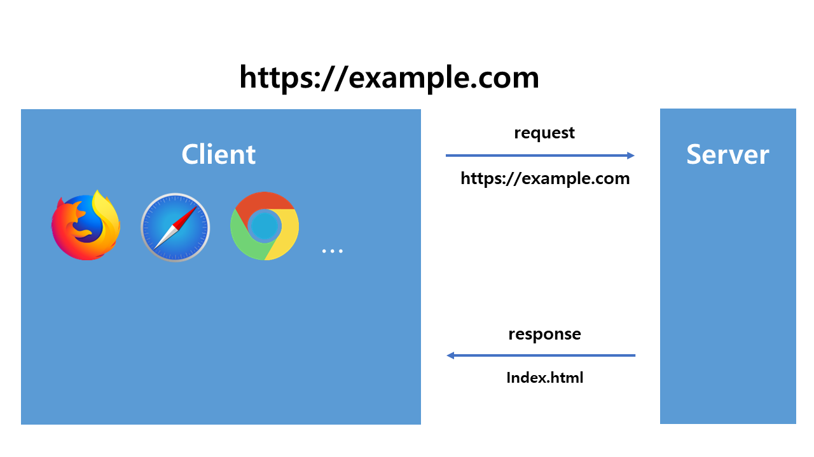
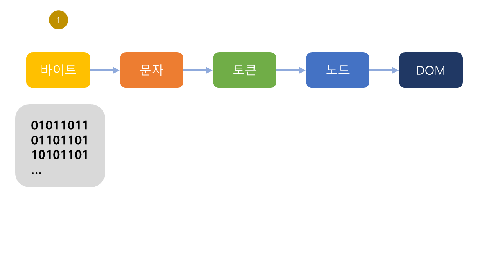
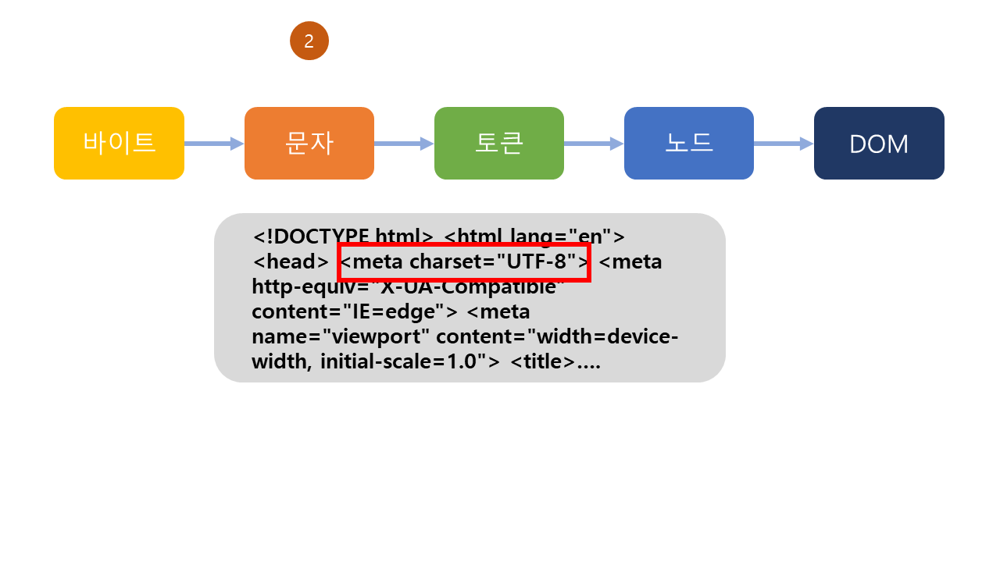
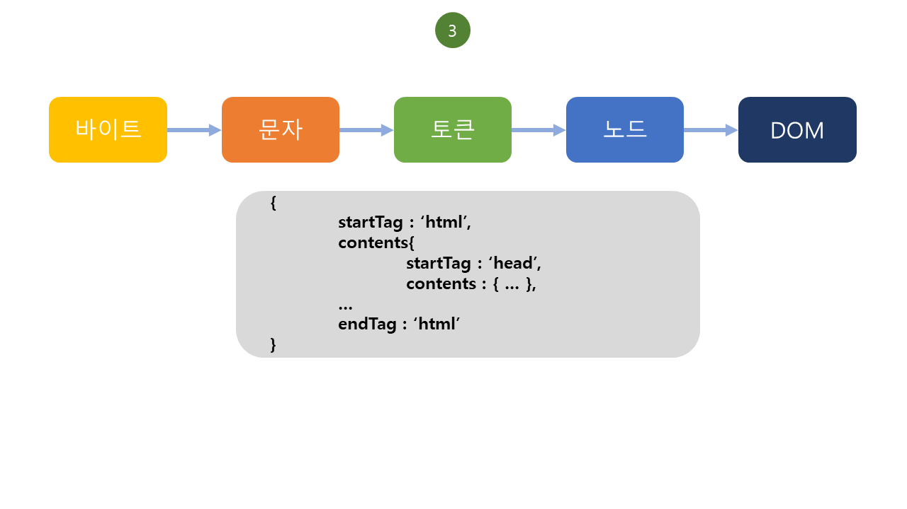
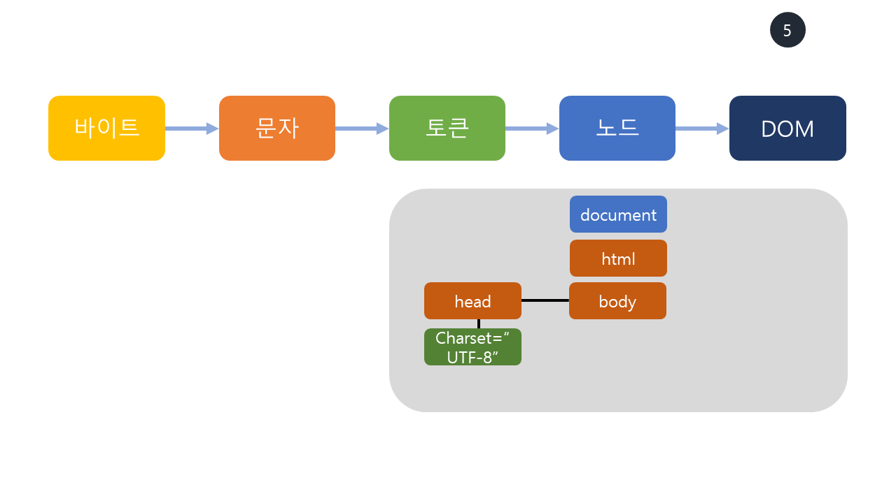
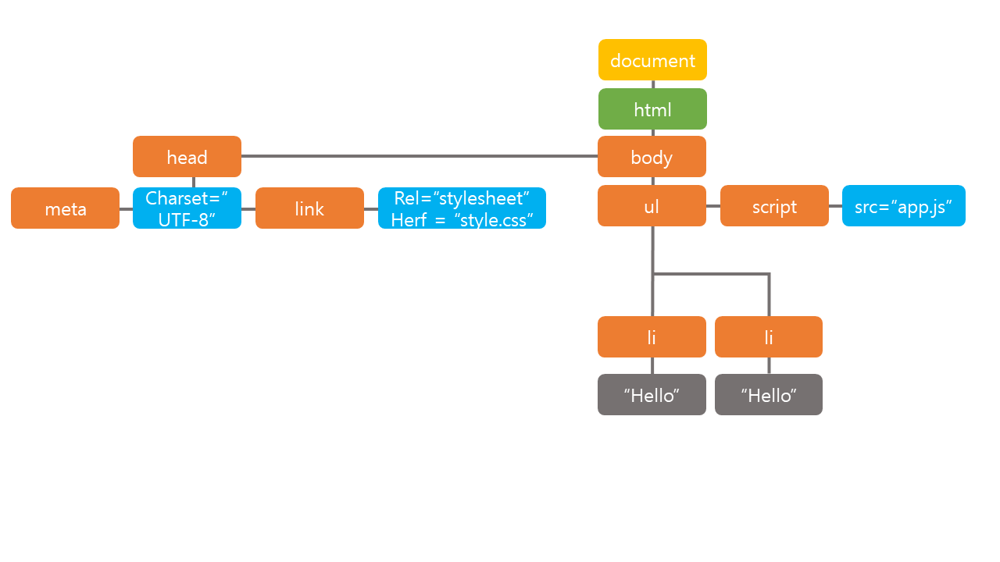
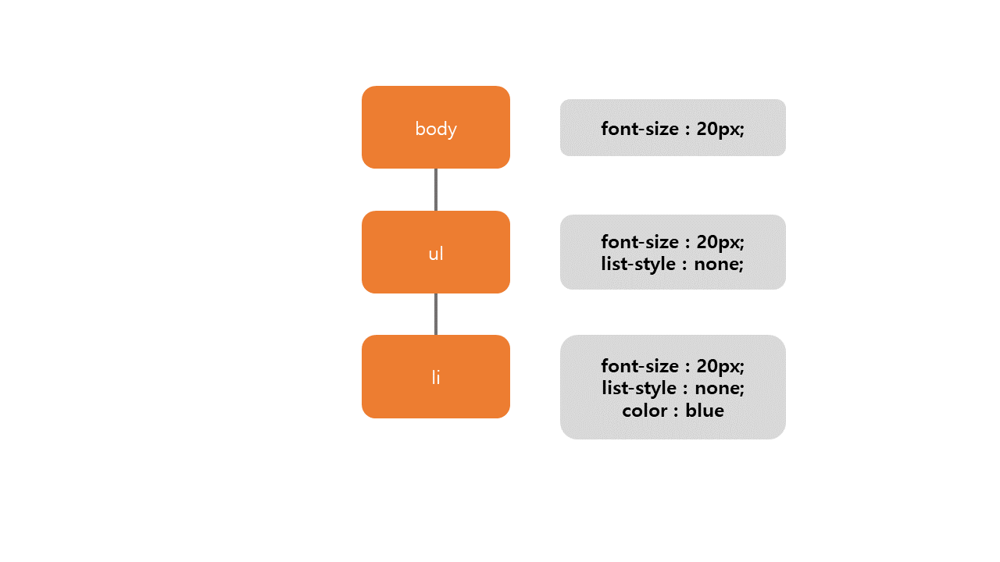

# 브라우저 렌더링

## 렌더링이란?

렌더링은 HTML, CSS, JS 등 개발자가 작성한 문서들을 브라우저가 화면에 그려주는 동작이다. 각 브라우저는 렌더링을 하기 위해 각각의 렌더링 엔진을 가지고 있으며, 브라우저마다 종류가 다르다. 

ex) 크롬 ⇒ 블링크 / 사파리 ⇒ 웹킷 / 파이어폭스 ⇒ 개코엔진

## 파싱이란?

파싱은 프로그래밍 언어의 문법에 맞게 작성된 텍스트 문서를 읽어들여 실행하기 위해 텍스트 문서의 문자열을 토큰으로 분해하고 토큰에 문법적인 의미와 구조를 반영해 트리 구조의 자로구조인 파스트리를 생성하는 일련의 과정이다.  파싱이 완료된 후에는 파스 트리를 기반으로 중간 언어인 바이트 코드를 실행하고 실행한다.

# 브라우저의 렌더링 과정 정리

1. 브라우저는 HTML, CSS, JS, 이미지, 폰트 파일 등 렌더링에 필요한 **리소스를 요청**하고 서버로부터 **응답을 받는다.**

2. **브라우저의 렌더링 엔진**은 서버로부터 응답된 HTML과 CSS를 파싱해 **DOM과 CSSOM을 생성**하고 이를 결합해 **렌더 트리를 생성**한다.

3. **브라우저의 자바스크립트 엔진**은 서버로부터 응답된 자바스크립트를 파싱해 **AST(Abstract Syntax Tree)**를 생성하고 바이트 코드로 변환해 실행한다. 이때 자바스크립트는 DOM API를 통해 DOM이나 CSSOM을 변경할 수 있다. **변경된 DOM 과 CSSOM은 다시 렌더 트리로 결합**된다. 

4. 렌더 트리를 기반으로 HTML 요소의 레이아웃(위치와 크기)를 계산하고 브라우저 화면에 **HTML 요소를 페인팅**한다.

## 1. 요청과 응답

브라우저의 핵심 기능은 필요한 리소스(HTML, CSS, JS, 이미지, 폰트 등의 정적 파일 또는 서버가 동적으로 생성한 데이터)를 서버에 요청하고 서버로부터 응답 받아 브라우저에 시각적으로 렌더링하는 것이다. (자원은 보통 HTML 문서지만 PDF나 이미지 또는 다른 형태일 수 있다.) 

 즉, 렌더링에 필요한 리소스는 모두 서버에 존재하므로 필요한 **리소스를 서버에 요청하고 서버가 응답한 리소스를 파싱해 렌더링**한다. 

자원의 주소는 **URI(Uniform Resource Identifier)에 의해 정해진다.** 서버에 요청을 전송하기 위해 브라우저는 **주소창**을 제공한다. 





브라우저의 주소창에 URL을 입력하고 엔터 키를 누르면 [DNS(domain name system)](https://ko.wikipedia.org/wiki/%EB%8F%84%EB%A9%94%EC%9D%B8_%EB%84%A4%EC%9E%84_%EC%8B%9C%EC%8A%A4%ED%85%9C)을 통해 IP 주소로 변환되고 이 IP 주소를 갖는 서버에게 요청을 전송한다.

EX) [https://example.com을](https://aaa.com을) 요청하면 암묵적으로 index.html을 응답하도록 기본 설정이 되어있다. 

즉, https://example.com은 https:///example.com.index.html과 같다. 

따라서 서버는 루트 요청에 대해 서버의 루트 폴더에 존재하는 정적 파일 index.html을 클라이언트로 응답한다. (만약 index.html이 아닌 다른 정적 파일을 서버에 요청하려먼 브라우저 주소창에 /assets/data.json 과 같이 요청할 정적 파일을 쓴 뒤 요청해야 한다.)

요청과 응답은 개발자 도구의 Network 패널에서 확인할 수 있다.


위의 예시는 [https://www.google.com](https://www.google.com) 을 브라우저에 검색했을 때 나타나는 네트워크 요청이다. 

google.com의 index 파일과 함께 다른 파일들이 응답된 것을 확인할 수 있다. 

이와 같이 브라우저에 파일이 요청되면 브라우저의 렌더링 엔진이 html을 파싱하는 도중에 외부 리소스를 로드하는 태그,즉 css 파일을 요청하는 태그나 이미지 파일, 자바스크립트를 로드하는 스크립트 태그를 만나면 HTML의 파싱을 일시 중단하고 해당 리소스 파일을 서버로 요청한다.

## 2-1. HTML 파싱과 DOM 생성

브라우저의 요청에 의해 서버가 응답한 HTML문서는 문자열로 이루어진 **순수 텍스트**이다. 

순수한 텍스트인 HTML 문서를 브라우저에 시각적인 픽셀로 렌더링하려면 HTML 문서를 브라우저가 이해할 수 있는 **자료구조(객체)로 변환**해 메모리에 저장해야 한다.

**브라우저의 렌더링 엔진은** 응답 받은 HTML 문서를 **파싱**하여 브라우저가 이해할 수 있는 자료구조인**DOM**을 생성한다.


1. 서버에 존재하던 HTML 파일이 브라우저의 요청에 의해 응답 된다. 이때 서버는 브라우저가 요청한 HTML 파일을 읽어 들여 메모리에 저장한 다음 메모리에 저장된 바이트(2진수)를 인터넷을 경유하여 응답한다. 

2. 브라우저는 서버가 응답한 HTML 문서를 바이트 형태로 응답받는다. 그리고 응답된 바이트 형태의 HTML 문서는 meta 태그의 charset 어트리뷰트에 의해 지정된 인코딩 방식을 기준을 문자열로 변환된다. 
    
    (meta 태그의 charset 어트리뷰트에 선언된 인코딩 방식은  charset 어트리뷰터에 선언된 인코딩 방식과 같이 응답 헤더에 담겨 응답된다. 브라우저는 이를 확인하고 문자열로 변환한다)
    
    ex) utf-8 ⇒ content-type : text/html; charset=utf-8
    

    
3. 문자열로 변환된 html 문서를 읽어 들여 문법적 의미를 갖는 코드의 최소 단위인 토큰들로 분해한다.


4. 각 토큰들을 객체로 변환하여 노드를 생성한다. 토큰의 내용에 따라 문서 노드, 요소 노드, 어트리뷰트 노드, 텍스트 노드가 생성된다. 노드는 이후 dom을 구성하는 기본 요소가 된다. 



5. DOM이 구성된다. HTML 요소간의 관계를 반영하여 모든 노드들을 트리 자료구조로 구성한다. HTML 문서는 HTML 요소들의 집합으로 이루어지며 HTML 요소는 중첩관계를 갖는다. 즉 HTML 요소의 콘텐츠 영역에는 텍스트 뿐 아니라 다른 HTML요소도 포함될 수 있다. 

**즉, DOM은 HTML 문서를 파싱한 결과물이다.**

# 2-2. CSS 파싱과 CSSOM 생성

렌더링 엔진은 HTML을 처음부터 한 줄씩 순차적으로 파싱해 DOM을 생성해나간다. 

이처럼 렌더링 엔진은 DOM을 생성하다가 CSS를 로드하는 link 태그나 style 태그를 만나면 dom 생성을 일시중단한다. 

```js
<!DOCTYPE html>
<html lang="en">
<head>
    <meta charset="UTF-8">
    <meta http-equiv="X-UA-Compatible" content="IE=edge">
    <meta name="viewport" content="width=device-width, initial-scale=1.0">
		<link rel="stylesheet" href="style.css"> // 렌더링 엔진이 일시 중단된다.
    <title>Document</title>
</head>
<body>
		<ul>
					<li>Hello</li>	
					<li>Bye</li>	
		</ul>
		<script src="app.js"></script>
</body>
</html>
```

그리고 link 태그의 href 어트리뷰트에 지정된 css 파일을 서버에 요청하여 로드한 css 파일이나 style 태그 내의 css를 html과 동일한 파싱 과정을 거치며 해석하여 **CSSOM을 생성**한다.

이후 CSS 파싱을 완료하면 HTML 파싱이 중단된 지점부터 다시 HTML을 파싱해 DOM을 이어서 만든다.

⇒ CSSOM은 CSS의 상속을 반영해 생성된다. 

# 2-3. 렌더 트리 생성

렌더링 엔진은 서버로부터 응답된 HTML과 CSS를 파싱해 각각 DOM과 CSSOM를 생성한다. 

그리고 DOM과 CSSOM은 렌더링을 위해 **렌더 트리로 결합**된다.

렌더 트리는 렌더링을 위한 트리 구조의 자료구조이다. 따라서 브라우저 화면에 렌더링되지 않는 노드( ex)meta 태그, script 태그 등) 과 css에 의해 표시되지 않는 노드들은 포함하지 않는다. 

**즉,  렌더 트리는 브라우저 화면에 렌더링되는 노드만으로 구성된다.** 

이후 완성된 렌더 트리는 각 HTML 요소의 레이아웃(위치와 크기)를 계산하는데 사용되며 브라우저 화면에 픽셀을 렌더링하는 페인팅 처리에 입력된다.

브라우저 렌더링 과정은 반복해서 실행될 수 있다. 

ex)

자바스크립트에 의한 노드의 추가 또는 삭제

브라우저 창의 리사이징에 의한 뷰포트 크기 변경

HTML 요소의 레이아웃 변경을 발생시키는

width, height, margin, padding, border, display, position, top/right/bottom/left 등의 스타일 변경

레이아웃 계산과 페인팅을 다시 실행하는 리렌더링은 비용이 많이 드는, 즉 성능에 악영향을 주는 작업이다. 따라서 가급적이면 리렌더링이 빈번하게 발생하지 않도록 주의해 한다. 

## 자바스크립트 파싱과 실행

HTML 문서를 파싱한 결과물로써 생성된 DOM은 HTML 문서의 구조와 정보뿐만 아니라 HTML 요소와 스타일 등을 변경할 수 있는 프로그래밍 인터페이스로서 DOM API를 제공한다. 즉, 자바스크립트 코드에서 DOM API를 변경할 수 있는 프로그래밍 인터페이스로서 DOM API를 제공한다. 

⇒ 자바스크립트 코드에서 DOM API를 사용하면 이미 생성된 DOM을 동적으로 조작할 수 있다.

 렌더링 엔진은 HTML을 한 줄씩 순차적으로 파싱하며 DOM을 생성해나가다가 JS파일을 로드하는 script 태그나 자바스크립트 코드를 콘텐츠로 담은 script 태그를 만나면 DOM 생성을 일시 중단한다. 

그리고 script 태그의 src 어트리뷰트에 정의된 자바스크립트 파일을 서버에 요청하여 로드한 자바스크립트 파일이나 script 태그 내의 자바스크립트 코드를 파싱하기 위해 자바스크립트 엔진에 제어권을 넘긴다. 

이후 자바스크립트 파싱과 실행이 종료되면 렌더링엔진으로 다시 제어권을 넘겨 중단 시점부터 다시 DOM 생성을 한다.

자바스크립트 파싱과 실행은 브라우저의 렌더링 엔진이 아닌 자바스크립트 엔진이 처리한다.

JS엔진은 자바스크립트 코드를 파싱하여 CPU가 이해할 수 있는 저수준 언어로 변환하고 실행하는 역할을 한다.

자바스크립트 엔진은 구글 크롬과 node.js의 v8, 사파리의 Javascript Core 등 다양한 종류가 있으며, 모든 자바스크립트 엔진은 ECMAScript 사양을 준수한다.

렌더링 엔진으로부터 제어권을 넘겨받은 자바스크립트 엔진은 자바스크립트 코드를 파싱하기 시작한다. 렌더링 엔진이 HTML과 CSS를 파싱하여 DOM과 CSSOM을 생성하듯이 자바스크립트 엔진은 자바스크립트를 해석해 AST를 생성한다. 그리고 AST를 기반으로 인터프리터가 실행할 수 있는 중간 코드인 바이트 코드를 생성하여 실행한다.

### 자바스크립트 소스 코드

## 토크나이징

단순한 문자열인 자바스크립트 소스코드를 어휘분석해 문법적 의미를 갖는 최소 단위인 토큰들로 분해한다. 이 과정을 렉싱이라고 부르기도 하지만 토크나이징과 미묘한 차이가 있다. 

## 파싱

토큰들의 집합을 구문 분석하여 AST를 생성한다. AST는 토큰에 문법적 의미와 구조를 반영한 트리 구조의 자료구조이다. AST는 인터프리터나 컴파일러만이 사용하는 것은 아니다. 

### 바이트 코드의 생성과 실행

파싱의 결과물로서 생성된 AST는 인터프리터가 실행할 수 있는 중간 코드인 바이트코드로 변환되고 인터프리터에 의해 실행된다. 참고로 V8엔진의 경우 자주 사용되는 코드는 터보팬이라 불리는 컴파일러에 의해 최적화된 머신 코드로 컴파일되어 성능을 최적화한다. 만약 코드의 사용 빈도가 적어지면 다시 디옵티마이징 하기도 한다. 

## 리플로우와 리페인트

만약 자바스크립트 코드에 DOM이나 CSSOM을 변경하는 DOM API가 사용된 경우 DOM이나 CSSOM이 변경된다. 

이때 변경된 DOM과 CSSOM은 다시 렌더 트리로 결합하고 변경된 렌더 트리를 기반으로 레이아웃과 페인트 과정을 거쳐 브라우저의 화면에 다시 렌더링한다. 

이를 리플로우, 리페인트라고 한다. 

### 리플로우

레이아웃 계산을 다시 하는 것. 

노드 추가/ 삭제, 요소의 크기/위치변경, 윈도우 리사이징 등 레이아웃에 영향을 주는 변경이 발생한 경우에 한해 실행된다. 리페인트는 재결합된 렌더 트리를 기반으로 다시 페인트를 하는 것을 말한다. 

따라서 리플로우와 리페인트가 반드시 순차적으로 동시에 실행되는 것은 아니다. 레이아웃에 영향이 없는 변경은 리플로우 없이 리페인트만 실행된다

## 자바스크립트 파싱에 의한 HTML 파싱 중단

지금까지 살펴본 바와 같이 렌더링 엔진과 자바스크립트 엔진은 병렬적으로 파싱을 실행하지 않고 직렬적으로 파싱을 수행한다.

이처럼 브라우저는 동기적으로, 즉 위에서 아래 방향으로 순차적으로 HTML, CSS, 자바스크립트를 파싱하고 실행한다.  

즉, script 태그의 위치에 따라 HTML 파싱이 블로킹되어 DOM 생성이 지연될 수 있다는 것을의미한다. 따라서 scipt 태그의 위치는 중요하다.

script가 조작하는 dom이 script가 생성되는 시점 보다 위에 있으면, 정상적으로 작동되지 않는다. 

또한 자바스키립트 로딩/파싱/실행으로 인해 HTML요소들의 렌더링에 지장받는 일이 발생한다. 

따라서 이러한 문제 때문에 body 요소의 가장 아래에 자바스크립트 태그를 위치시킨다.

## async / defer 어트리뷰트

이러한 문제를 근본적으로 해결하기 위해 HTML5 부터 script 태그에 async와 defaer 어트리뷰트가 추가되었다.  

async 와 defer 어트리뷰트는 외부 자바스크립트를 로드하는 경우에 사용가능하다.